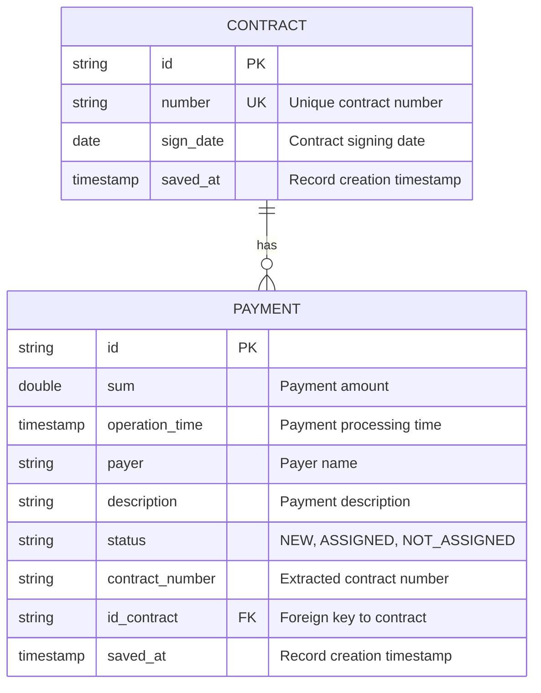

# Database Schema

This document describes the database schema for the Spring Advanced application.

## Entity Relationship Diagram

## Tables

### contract

Stores contract information.

| Column | Type | Constraints | Description |
|--------|------|-------------|-------------|
| id | VARCHAR | PRIMARY KEY | Contract ID |
| number | VARCHAR | UNIQUE | Contract number |
| sign_date | DATE | | Contract signing date |
| saved_at | TIMESTAMP | | Record creation timestamp |

### payment

Stores payment information with optional contract association.

| Column | Type | Constraints | Description |
|--------|------|-------------|-------------|
| id | VARCHAR | PRIMARY KEY | Payment ID |
| sum | DOUBLE | | Payment amount |
| operation_time | TIMESTAMP | | Payment processing time |
| payer | VARCHAR | | Payer name from bank statement |
| description | VARCHAR | | Payment description from bank statement |
| status | VARCHAR | | Payment status: NEW, ASSIGNED, NOT_ASSIGNED |
| contract_number | VARCHAR | | Contract number extracted from description |
| id_contract | VARCHAR | FOREIGN KEY | Reference to contract.id |
| saved_at | TIMESTAMP | | Record creation timestamp |

## Relationships

- **CONTRACT** to **PAYMENT**: One-to-Many
  - One contract can have multiple payments
  - A payment may be associated with zero or one contract
  - Relationship is established through `id_contract` foreign key

## Payment Processing Flow

1. Payment is created with status `NEW`
2. Scheduler extracts `contract_number` from payment description
3. System searches for matching contract by number
4. If found: payment is linked via `id_contract` and status becomes `ASSIGNED`
5. If not found: status becomes `NOT_ASSIGNED`
